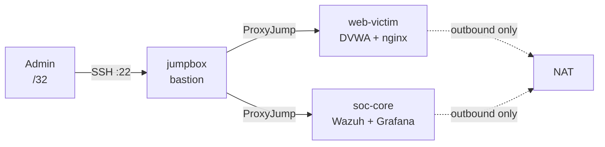

# soc-lab

[](https://github.com/dininduabey/soc-lab/actions/workflows/ci.yml)

A reproducible Security Operations lab on Oracle Cloud **Always Free**, built
entirely from code. Terraform provisions the network and hosts; Ansible
discovers them by cloud tag and configures them. `terraform destroy` followed
by `terraform apply` rebuilds the whole environment from nothing.

Runs at **zero cost** — every resource fits inside the Always Free tier.

## What it does

A bastion-fronted network hosting a deliberately vulnerable web app (DVWA)
behind nginx, monitored by a Wazuh SIEM and a Prometheus/Grafana stack, with
controlled attacks generating detections. The vulnerable target is **never
reachable from the internet**.



## Stack

| Layer | Tool |
|-------|------|
| Infrastructure | Terraform (OCI provider) |
| Configuration | Ansible with OCI dynamic inventory |
| Containers | Docker + Compose |
| SIEM | Wazuh (manager, indexer, dashboard) |
| Observability | Prometheus + Grafana |
| Target | DVWA behind nginx |
| CI | GitHub Actions — Terraform, ansible-lint (production profile), yamllint, shellcheck |

## Highlights

- **Reproducible.** The entire lab is code. No manual console steps after signup.
- **Tag-driven inventory.** Ansible discovers hosts from OCI `role` tags — no
  static hosts file. New hosts are picked up automatically.
- **Isolation by three independent controls.** No public IP, subnet-level
  prohibition, no inbound route. See [security-decisions.md](docs/security-decisions.md).
- **Idempotent.** Repeated playbook runs report `changed=0`.
- **Handles real free-tier constraints.** ARM capacity is obtained with an
  AD-rotating retry loop; shapes are pinned to stay free permanently.

## Documentation

- [Architecture](docs/architecture.md) — topology, hosts, isolation model
- [Runbook](docs/runbook.md) — build, access, operate, tear down
- [Security decisions](docs/security-decisions.md) — the non-obvious choices and why

## Quick start

```bash
cd terraform && terraform init && terraform apply -var="create_arm_instance=false"
../scripts/arm-capacity-retry.sh          # obtains the ARM host
cd ../ansible && ansible-playbook -i inventory/soclab.oci.yml site.yml
```

See the [runbook](docs/runbook.md) for prerequisites and detail.
