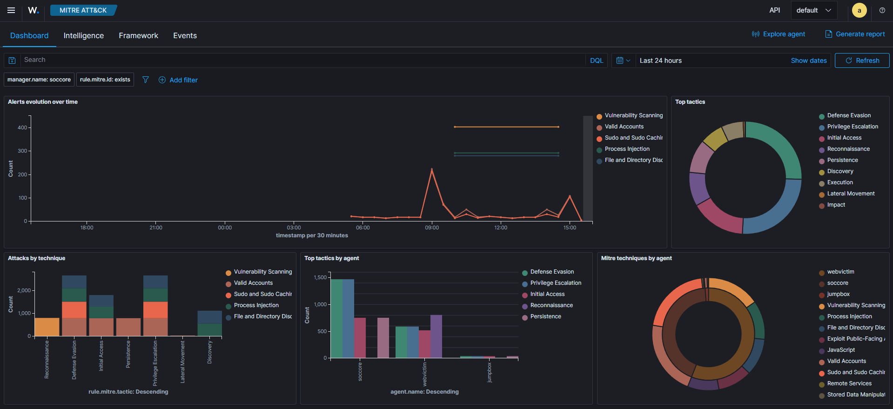
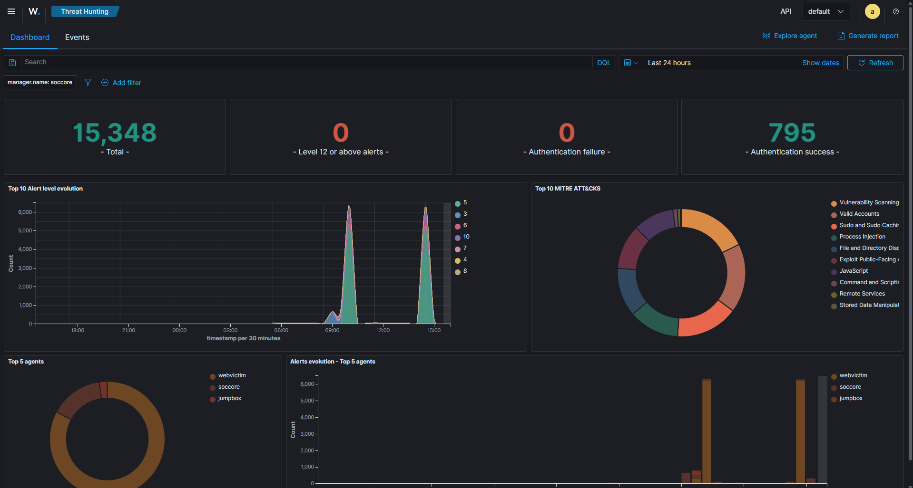
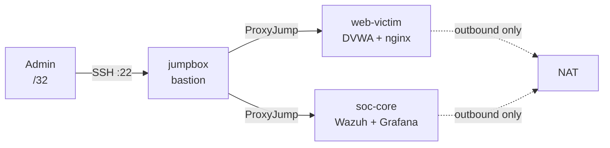

# soc-lab

[](https://github.com/dininduabey/soc-lab/actions/workflows/ci.yml)





A reproducible Security Operations lab on Oracle Cloud **Always Free**, built
entirely from code. Terraform provisions the network and hosts; Ansible
discovers them by cloud tag and configures them. `terraform destroy` followed
by `terraform apply` rebuilds the whole environment from nothing.

Runs at **zero cost** — every resource fits inside the Always Free tier.

## What it does

A bastion-fronted network hosting a deliberately vulnerable web app (DVWA)
behind nginx, monitored by a Wazuh SIEM and a Prometheus/Grafana stack, with
controlled attacks generating detections. The vulnerable target is **never
reachable from the internet**.



## Stack

| Layer | Tool |
|-------|------|
| Infrastructure | Terraform (OCI provider) |
| Configuration | Ansible with OCI dynamic inventory |
| Containers | Docker + Compose |
| SIEM | Wazuh (manager, indexer, dashboard) |
| Observability | Prometheus + Grafana |
| Target | DVWA behind nginx |
| CI | GitHub Actions — Terraform, ansible-lint (production profile), yamllint, shellcheck |

## Highlights

- **Reproducible.** The entire lab is code. No manual console steps after signup.
- **Tag-driven inventory.** Ansible discovers hosts from OCI `role` tags — no
  static hosts file. New hosts are picked up automatically.
- **Isolation by three independent controls.** No public IP, subnet-level
  prohibition, no inbound route. See [security-decisions.md](docs/security-decisions.md).
- **Idempotent.** Repeated playbook runs report `changed=0`.
- **Handles real free-tier constraints.** ARM capacity is obtained with an
  AD-rotating retry loop; shapes are pinned to stay free permanently.

## Documentation

- [**Setup guide**](docs/SETUP.md) — build this lab from zero, step by step

- [Architecture](docs/architecture.md) — topology, hosts, isolation model
- [Runbook](docs/runbook.md) — build, access, operate, tear down
- [Security decisions](docs/security-decisions.md) — the non-obvious choices and why

## Quick start

```bash
# 1. Build the network + x86 hosts (always available)
cd terraform && terraform init && terraform apply -var="create_arm_instance=false"

# 2. Obtain the scarce ARM SIEM host (retry loop; can take minutes to days)
../scripts/arm-capacity-retry.sh
#    Once it succeeds, set  create_arm_instance = true  in terraform.tfvars
#    so a plain apply never destroys it.

# 3. Configure everything: hardening, Docker, DVWA, Grafana stack,
#    attack tooling, the Wazuh SIEM, and agents
cd ../ansible && ansible-playbook -i inventory/soclab.oci.yml site.yml
```

See the [runbook](docs/runbook.md) for prerequisites and detail.


## Live demo

Show the lab attacking itself and getting caught. **Open the dashboard first, then attack**, so the graph moves live in front of your audience.

```bash
# 0. Get current instance IPs (they change on rebuild) + confirm SSH access
cd terraform && terraform output && cd ..
ssh soc-jump "echo ready"

# 1. Dashboard tunnel (Terminal 1 - leave open). Port 8443 -> Wazuh SIEM.
#    Use soc_core_private_ip from step 0 in place of <soc-core-private-ip>.
ssh -L 8443:<soc-core-private-ip>:443 soc-jump
#    Browse https://localhost:8443 -> log in -> Threat Hunting -> Last 24 hours -> auto-refresh on

# 2. Fire the attack (Terminal 2). No tunnel needed - runs on the jumpbox.
ssh soc-jump "/opt/attack/run-attacks.sh <web-victim-private-ip>"

# 3. Wait ~1-2 min for ingestion, watch the spike appear in Threat Hunting and MITRE ATT&CK.
```

Optional - Grafana (Terminal 3), the faster-updating view as a fallback:

```bash
ssh -L 3000:localhost:3000 soc-jump   # then browse http://localhost:3000
```

Get private IPs with `terraform -chdir=terraform output`. If SSH times out, your home IP rotated - see the [runbook](docs/runbook.md).
