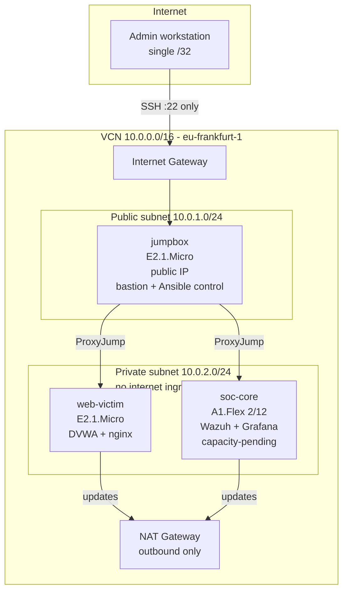

# Architecture

## Overview

A security operations lab on Oracle Cloud Infrastructure Always Free, provisioned
by Terraform and configured by Ansible. The design goal is a realistic
attacker/defender environment where the vulnerable target is genuinely
unreachable from the internet.

## Network topology

## Hosts

| Host | Shape | Subnet | Public IP | Role |
|------|-------|--------|-----------|------|
| jumpbox | E2.1.Micro (1 GB) | public | yes, /32-restricted | Bastion, Ansible control node, attack origin |
| web-victim | E2.1.Micro (1 GB) | private | none | DVWA behind nginx — the target |
| soc-core | A1.Flex (2 OCPU / 12 GB) | private | none | Wazuh SIEM + Prometheus + Grafana |

## Isolation model

The vulnerable target is unreachable from the internet by three independent controls:

1. **No public IP** — `assign_public_ip = false` on the instance.
2. **Subnet-level prohibition** — `prohibit_public_ip_on_vnic = true` rejects
   a public IP at the API even if requested.
3. **No inbound route** — the private subnet routes outbound through a NAT
   gateway; nothing on the internet can initiate a connection inward.

Operator access to private hosts is via SSH `ProxyJump` through the bastion,
whose security list permits port 22 from a single administrator `/32`.

## Toolchain

- **Terraform** provisions the VCN, subnets, gateways, security lists, and instances.
- **Ansible** discovers hosts through the OCI dynamic inventory plugin — grouping
  them by the `role` freeform tag Terraform assigns — and applies roles for
  baseline hardening, Docker, DVWA, and nginx.
- **GitHub Actions** lints Terraform, Ansible, YAML, and shell on every push.
