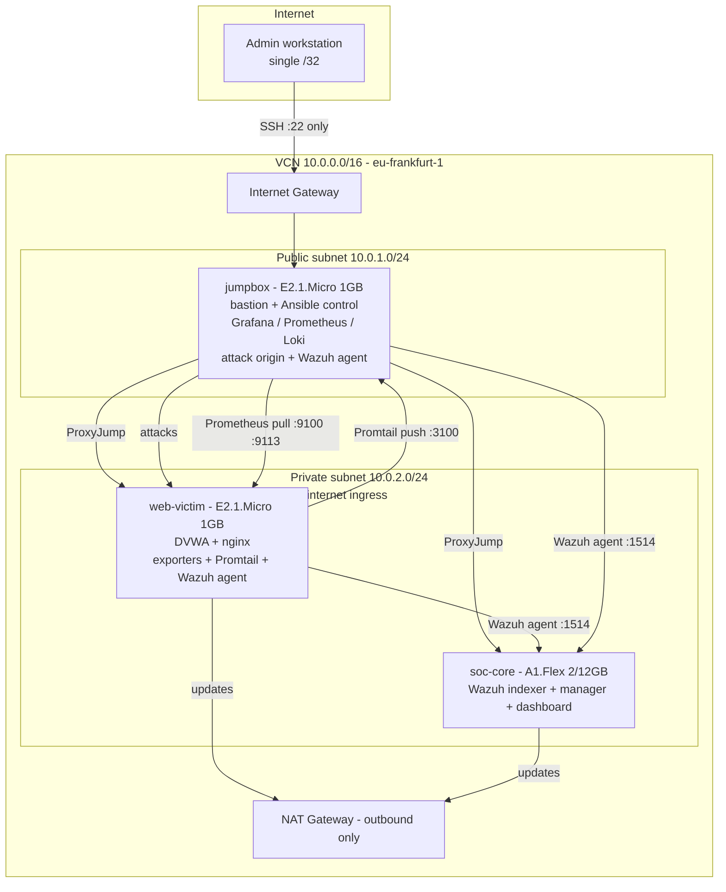

# Architecture

## Overview

A security operations lab on Oracle Cloud Infrastructure Always Free,
provisioned by Terraform and configured by Ansible. It runs a realistic
attacker/defender environment — a deliberately vulnerable web app, automated
attacks against it, and two independent monitoring stacks that observe the
result — all reproducible from code and running at zero cost.

## How the ARM host was obtained

soc-core is a 12 GB ARM (Ampere A1) instance, which is the most contended
resource in the OCI free tier. Capacity was unavailable for an extended period,
so the ARM instance is provisioned by an availability-domain-rotating retry
loop (`scripts/arm-capacity-retry.sh`) rather than a one-shot apply. Once
capacity was obtained, the full Wazuh SIEM was installed on it natively. The
x86 monitoring stack (Grafana/Prometheus/Loki) was built first on the always-
available micro instances and remains in place, so the lab carries two
complementary monitoring layers.

## Network topology

## Hosts

| Host | Shape | Subnet | Public IP | Role |
|------|-------|--------|-----------|------|
| jumpbox | E2.1.Micro (1 GB) | public | yes, /32-restricted | Bastion, Ansible control, attack origin, Grafana/Prometheus/Loki, Wazuh agent |
| web-victim | E2.1.Micro (1 GB) | private | none | DVWA behind nginx; node/nginx exporters, Promtail, Wazuh agent |
| soc-core | A1.Flex (2 OCPU / 12 GB) | private | none | Wazuh SIEM — indexer, manager, dashboard |

## Two monitoring layers, two purposes

**Observability (Grafana stack, on the jumpbox)** answers "is the
infrastructure healthy, and what does traffic look like?"
- Prometheus scrapes node_exporter (:9100) and nginx-exporter (:9113) on the
  victim — metrics via pull.
- Promtail on the victim ships nginx access logs to Loki (:3100) on the
  jumpbox — logs via push.
- Grafana visualizes both, reached by SSH tunnel.

**Security (Wazuh SIEM, on soc-core)** answers "are we being attacked, and how?"
- Wazuh agents on the victim and jumpbox send host events to the manager
  (:1514).
- The manager runs events through rulesets mapped to MITRE ATT&CK and writes
  alerts.
- Filebeat ships alerts to the indexer; the dashboard visualizes them, reached
  by SSH tunnel.

The distinction is the point: the Grafana stack is DevOps observability; Wazuh
is security detection. Together they cover both halves of what a real SOC
watches.

## Isolation model

The vulnerable target is unreachable from the internet by three independent
controls: no public IP on the instance; `prohibit_public_ip_on_vnic = true` at
the subnet; and a private subnet whose only route out is a NAT gateway
(outbound only). Operator access is via SSH ProxyJump through the bastion,
whose security list permits port 22 from a single administrator /32.

## Resource footprint

Everything fits inside Always Free: 2× E2.1.Micro + 1× A1.Flex (2 OCPU/12 GB),
150 GB of the 200 GB block-storage allowance, and a VCN with gateways and
security lists (all free). The observability stack runs on a 1 GB host via
per-container memory caps and swap; the Wazuh indexer's JVM heap is pinned to
4 GB to fit the 12 GB ARM host alongside the manager and dashboard.
