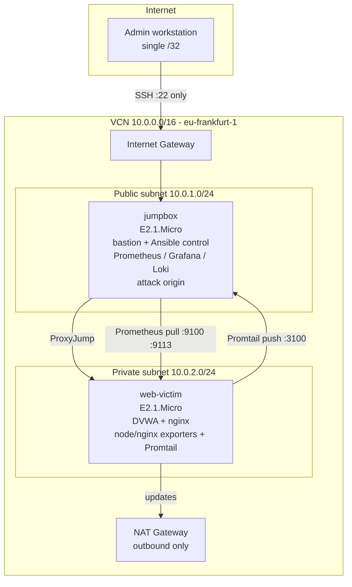

# Architecture

## Overview

A security operations lab on Oracle Cloud Infrastructure Always Free,
provisioned by Terraform and configured by Ansible. The design goal is a
realistic attacker/defender environment where the vulnerable target is
genuinely unreachable from the internet, running at zero cost.

## A note on the ARM pivot

The original design placed a Wazuh SIEM on a 12 GB ARM (Ampere A1) instance.
OCI Always Free ARM capacity in the home region was exhausted for an extended
period — a well-documented supply constraint, not an account issue. Rather than
block on it, the monitoring layer was rebuilt on the always-available x86 tier
using Prometheus, Loki, and Grafana. Because the whole lab is defined as code,
this pivot changed which roles run on which host, not the shape of the
architecture. An AD-rotating retry loop for the ARM instance remains in the
repo; if capacity returns, the SIEM host slots in without disturbing the rest.

## Network topology

## Hosts

| Host | Shape | Subnet | Public IP | Role |
|------|-------|--------|-----------|------|
| jumpbox | E2.1.Micro (1 GB) | public | yes, /32-restricted | Bastion, Ansible control, Prometheus + Grafana + Loki, attack origin |
| web-victim | E2.1.Micro (1 GB) | private | none | DVWA behind nginx; node_exporter, nginx-exporter, Promtail |

## Monitoring data flow

- **Metrics (pull):** Prometheus on the jumpbox scrapes node_exporter (:9100)
  and nginx-prometheus-exporter (:9113) on the victim across the VCN.
- **Logs (push):** Promtail on the victim tails the nginx access log and pushes
  to Loki (:3100) on the jumpbox.
- **Visualization:** Grafana reads both, provisioned with datasources and a
  dashboard as code. Reached by SSH tunnel; not exposed on any public port.

## Isolation model

The vulnerable target is unreachable from the internet by three independent
controls: no public IP on the instance; `prohibit_public_ip_on_vnic = true` at
the subnet; and a private subnet whose only route out is a NAT gateway
(outbound-only). Operator access is via SSH ProxyJump through the bastion,
whose security list permits port 22 from a single administrator /32.

## Resource footprint

Everything fits inside Always Free: 2× E2.1.Micro instances, 100 GB of the
200 GB block-storage allowance, and a VCN with gateways and security lists
(all free). The full observability stack runs on a 1 GB host via hard
per-container memory caps and a 2 GB swap safety net.
